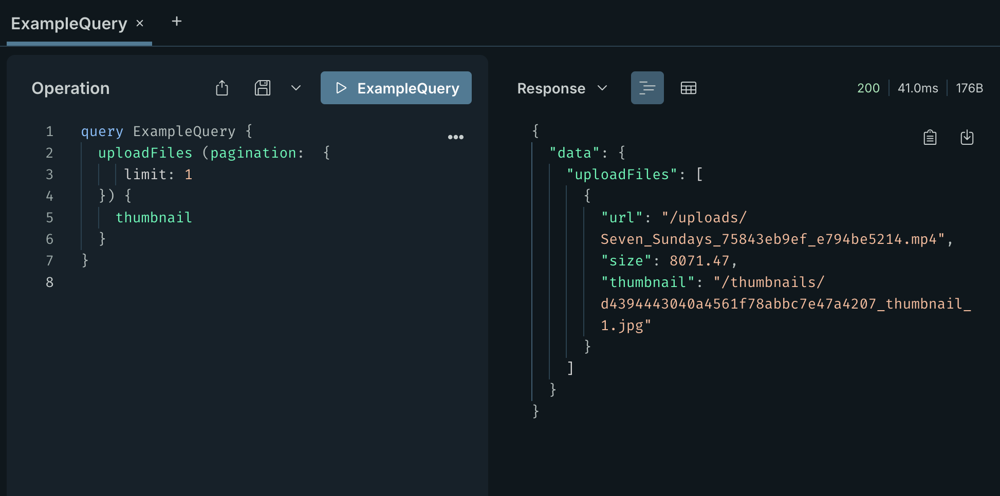

# Video Thumbnails GraphQl Plugin for Strapi

 

This plugin extends the GraphQL API to provide video thumbnail generation capabilities. It allows users to request thumbnails for videos stored in the public folder.



## Requirements

- Strapi v5.x
- GraphQL plugin installed and configured
- ffmpeg installed on the server where Strapi is running
- Node.js respectively

## Installation

To install the plugin, you can use npm or yarn. Make sure you are in the root directory of your Strapi project and have the ffmpeg library installed on your server. Then run one of the following commands:

```bash
# Install the plugin
npm install strapi-video-thumbnails

# or use yarn
yarn add strapi-video-thumbnails
 
```

### Enable the Plugin in Strapi

Edit strapi’s `config/plugins.js` file to enable the video thumbnails plugin like this:

```typescript
export default () => ({
	// { Other plugins … }
	"video-thumbnails": {
		enabled: true,
		config: {
			thumbnailsPath: "thumbnails",
			thumbnailSize: '1280x720',
			timeOffset: "00:00:01",
		},
	},
});
```


## Usage

To use this plugin, you need to make a GraphQL query to the `videoThumbnails` endpoint. The plugin will generate thumbnails for the specified video and return the URLs of the generated thumbnails.

```graphql
# Example GraphQL query to get video thumbnails
query ExampleQuery {
	uploadFiles (pagination:  {
		limit: 1
	}) {
		# default UploadFile fields
		# url
		# formats
		# …
		thumbnail
	}
}
```
